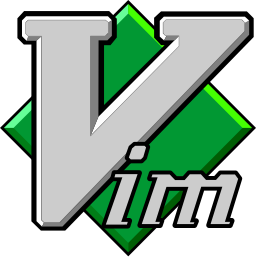

## Hi there 👋, my name is [Francisco][portfolio]

### Ph.D. Student in Applied Mathematics | Full Stack Developer

I made this project just for fun, it allows you to create nice and simple GitHub Readme files that you can copy/paste and use in your profile.

- 🔭 I’m currently working on my Ph.D. thesis and side projects.
- 🌱 I’m currently learning Deep Learning and App development.
- 👀 I’m looking for internship opportunities while I finish my Ph.D.
- 📫 How to reach me: fjcasti1@asu.edu
- 🌐 Visit my [Portfolio][portfolio]

#### Connect with me
[][portfolio] [][linkedin]
 

#### Languages and Tools

I've developed a strong understanding of the following programming languages:

 

In my web-development projects, I have used the following technologies:

 
 
 
 
 
 
 
 
 
 
 
 
 

 
 

Some of the tools I use:

 
 
 
 
 

 
 

Currently learning:

 
 
 

---

  

---

#### Spotify Playing 🎧

<!-- Variable definitions -->

[portfolio]: https://personal-portfolio-7018a.web.app
[linkedin]: https://linkedin.com/f-castillo-carrasco
[stats]: https://linkedin.com/f-castillo-carrasco
